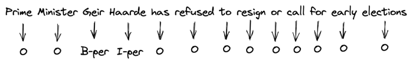
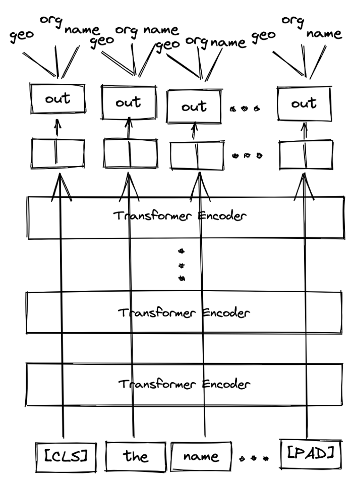

<div align="center">

# Event Lineup Extraction NN

<a href="https://www.python.org/"></a>
<a href="https://pytorch.org/get-started/locally/"></a>
<a href="https://pytorchlightning.ai/"></a>
<a href="https://hydra.cc/"></a>
<a href="https://black.readthedocs.io/en/stable/"></a>

A ML framework demonstration. 
</div>

<br><br>

## 📌&nbsp;&nbsp;Introduction

This a quickly produced example NN designed to predict event lineups given the event titles. 

**Using the lightning-hydra-template:** This example was built using the [lightning-hydra-template](https://github.com/ashleve/lightning-hydra-template) developed by [ashleve](https://github.com/ashleve). This is a template that I prefer for quickly setting up prototype ML projects. While it is effective for quickly developing prototype ML projects it's not intended for production/deployment environment. I've kept useful parts of the original readme. 

## Why Hydra?

[Hydra](https://github.com/facebookresearch/hydra) is an open-source Python framework that simplifies the development of research and other complex applications. The key feature is the ability to dynamically create a hierarchical configuration by composition and override it through config files and the command line. It allows you to conveniently manage experiments and provides many useful plugins, like [Optuna Sweeper](https://hydra.cc/docs/next/plugins/optuna_sweeper) for hyperparameter search, or [Ray Launcher](https://hydra.cc/docs/next/plugins/ray_launcher) for running jobs on a cluster.
## BERT Model

When addressing the problem of identifying event names with the artists I had considered a generative approach. However, this could result in nonsensical names and the data set is too limited. It's possible to use a combination of the input data + data scraped from the web to identify the artists but I opted against this path because I wanted it to be a ML demonstration rather than a scraping demo plus this would limit us to events that can be scraped. I instead opted to use a NLP model and named entity recognition (NER) to try to identify artist/team/comedian/ect entity labels in event titles, which turns this into an NPL classification problem. 

BERT is a NLP transformer-based model that has had a lot of success with text classification. It also has a tokenizer that will make the task of formatting the inputs and labels much easier. Due to the limited data set (only ~1200 samples) it would require using transfer-learning on a pretrained model. BERT is an obvious pick for this case as there's a number of pretrained BERT models that can be selected for and it's had good results in similar use cases and can be trained on modest hardware (which I'm limited to for personal projects). It's also possible to expand the labels to differentiate between different types of events (music, sport, comedy show, ect.) however, with the limited data set I restricted it to a single class of names to simplify training and to make labeling easier, as this will need to be done by hand and is quite time intensive. 

This is the first project I've done using the BERT model and I want to credit [Ruben Winastwan](https://medium.com/@marcellusruben) from Medium and his [article](https://towardsdatascience.com/named-entity-recognition-with-bert-in-pytorch-a454405e0b6a) for images and a jumping off point for prototyping the project. Any images below are borrowed from his article. 

## Labeling the data

Since artist names can very in word-length, the BERT model uses labels to identify the start and end of a given class of labels, which is know as the Inside-Outside-Beginning (IOB) tagging. While there are multiple label classes, for simplicity I'll limit the explanation to the one class being used in the model, the "person" class or 'per'. With the person tag, to label a person in a sentence we would start with the "B-per" tag. The B in this case refers to the beginning of the person's name. If the name is multiple words, the next label would be "I-per" for intermediate. All unrelated words would be labeled with the capital o, as can be seen in the image below.

<p align="center">
  
</p>

A tokenizer then further splits words up into subcomponents, includes start and stop tokens, and padding for the fixed input size, which make it easier for the network to process the inputs. This requires adjusting the labels to the tokenized inputs. Once the data is prepared and provided to the model, we used the embedded vectorized output from each of the tokens to classify each word in the sentence. 

<p align="center">
  
</p>
<br>

## 🚀&nbsp;&nbsp;Quickstart

```bash
# clone project
git clone https://github.com/natephysics/event-lineup-extraction
cd event-lineup-extraction

# [OPTIONAL] create conda environment
conda create -n myenv python=3.8
conda activate myenv

# install pytorch according to instructions
# https://pytorch.org/get-started/

# install requirements
pip install -r requirements.txt
```

Once the environment is ready there are a few preliminary steps before training can be done. 
1. Place the `event_titles.txt` and `artists.txt` files into the `data/` directory.
2. If a CUDA capable GPU is not present, set the `gpu: 1` parameter in `configs/trainer/default.yaml` to `gpu: 0`. (or to the number of trainable GPUs)
3. In the same file, `configs/trainer/default.yaml`, set the `max_epochs: 200` as desired, so training doesn't take excessively long. 200 is quick enough for a GPU but is likely too slow for a CPU for demonstration purposes. 
4. From the project directory, run: 
    ```bash
    python train.py
    ```
    Training results can be viewed in real time using Tensorboard using the command:
    ```bash
    tensorboard --logdir ./logs/experiments/runs/default/
    ```
    Training results, checkpoints, and logging are all found in the logs/ directory. See the logs section below for more details on the directory structure. 

## Project Structure

The directory structure of new project looks like this:

```
├── configs                   <- Hydra configuration files
│   ├── callbacks                <- Callbacks configs
│   ├── datamodule               <- Datamodule configs
│   ├── debug                    <- Debugging configs
│   ├── experiment               <- Experiment configs
│   ├── hparams_search           <- Hyperparameter search configs
│   ├── local                    <- Local configs
│   ├── log_dir                  <- Logging directory configs
│   ├── logger                   <- Logger configs
│   ├── metrics                  <- Metrics configs
│   ├── model                    <- Model configs
│   ├── optimizer                <- Optimizer configs
│   ├── trainer                  <- Trainer configs
│   │
│   ├── test.yaml            <- Main config for testing
│   └── train.yaml           <- Main config for training
│
├── data                     <- Project data (place event_titles.txt and artists.txt here)
│   └── binary_labels.txt    <- Manually produced labels
│
├── logs                     <- Logs generated by Hydra and PyTorch Lightning loggers
│
├── notebooks                <- Jupyter notebooks. 
│   ├── data_cleaning.ipynb       <- Preprocessing and data sanity checks
│   └── name_matching.ipynb       <- Simple fuzzy-matching for events/artist names
│
├── scripts                  <- Shell scripts
│
├── src                      <- Source code
│   ├── datamodules              <- Lightning datamodules
│   ├── models                   <- Lightning models
│   ├── utils                    <- Utility scripts
│   ├── vendor                   <- Third party code that cannot be installed using PIP/Conda
│   │
│   ├── testing_pipeline.py
│   └── training_pipeline.py
│
├── tests                  <- Tests of any kind
│   ├── helpers                  <- A couple of testing utilities
│   ├── shell                    <- Shell/command based tests
│   └── unit                     <- Unit tests
│
├── test.py               <- Run testing
├── train.py              <- Run training
│
├── .env.example              <- Template of the file for storing private environment variables
├── .gitignore                <- List of files/folders ignored by git
├── .pre-commit-config.yaml   <- Configuration of pre-commit hooks for code formatting
├── requirements.txt          <- File for installing python dependencies
├── setup.cfg                 <- Configuration of linters and pytest
└── README.md
```

<br>

## Logs

**Hydra creates new working directory for every executed run.** By default, logs have the following structure:

```
├── logs
│   ├── experiments                     # Folder for the logs generated by experiments
│   │   ├── ckpts                         # Folder for checkpoints used for testing
│   │   ├── runs                          # Folder for single runs
│   │   │   ├── experiment_name             # Experiment name
│   │   │   │   ├── YYYY-MM-DD_HH-MM-SS       # Datetime of the run
│   │   │   │   │   ├── .hydra                  # Hydra logs
│   │   │   │   │   ├── csv                     # Csv logs
│   │   │   │   │   ├── wandb                   # Weights&Biases logs
│   │   │   │   │   ├── checkpoints             # Training checkpoints
│   │   │   │   │   └── ...                     # Any other thing saved during training
│   │   │   │   └── ...
│   │   │   └── ...
│   │   │
│   │   └── multiruns                     # Folder for multiruns
│   │       ├── experiment_name             # Experiment name
│   │       │   ├── YYYY-MM-DD_HH-MM-SS       # Datetime of the multirun
│   │       │   │   ├──1                        # Multirun job number
│   │       │   │   ├──2
│   │       │   │   └── ...
│   │       │   └── ...
│   │       └── ...
│   │
│   ├── evaluations                       # Folder for the logs generated during testing
│   │   └── ...
│   │
│   └── debugs                            # Folder for the logs generated during debugging
│       └── ...
```


## License

This project is licensed under the MIT License.

```
MIT License

Copyright (c) 2021 ashleve

Permission is hereby granted, free of charge, to any person obtaining a copy
of this software and associated documentation files (the "Software"), to deal
in the Software without restriction, including without limitation the rights
to use, copy, modify, merge, publish, distribute, sublicense, and/or sell
copies of the Software, and to permit persons to whom the Software is
furnished to do so, subject to the following conditions:

The above copyright notice and this permission notice shall be included in all
copies or substantial portions of the Software.

THE SOFTWARE IS PROVIDED "AS IS", WITHOUT WARRANTY OF ANY KIND, EXPRESS OR
IMPLIED, INCLUDING BUT NOT LIMITED TO THE WARRANTIES OF MERCHANTABILITY,
FITNESS FOR A PARTICULAR PURPOSE AND NONINFRINGEMENT. IN NO EVENT SHALL THE
AUTHORS OR COPYRIGHT HOLDERS BE LIABLE FOR ANY CLAIM, DAMAGES OR OTHER
LIABILITY, WHETHER IN AN ACTION OF CONTRACT, TORT OR OTHERWISE, ARISING FROM,
OUT OF OR IN CONNECTION WITH THE SOFTWARE OR THE USE OR OTHER DEALINGS IN THE
SOFTWARE.
```